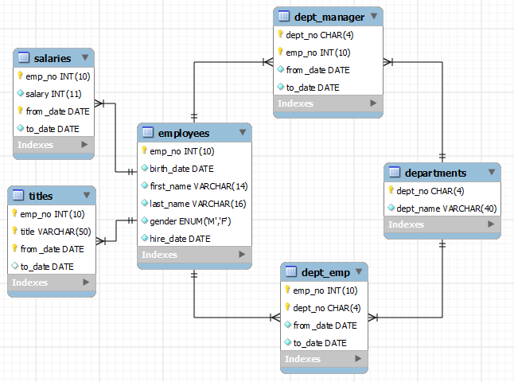

### MySQL's Sample Employee Database

Reference: MySQL's Sample Employees Database @ [http://dev.mysql.com/doc/employee/en/index.html](http://dev.mysql.com/doc/employee/en/index.html).

This is a rather simple database with 6 tables but with millions of records.

#### Database and Tables

There are 6 tables as follows:

Use SQL employees.sql
