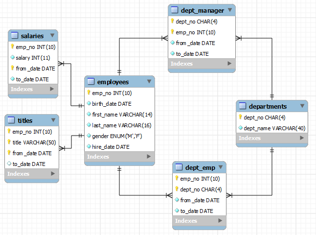
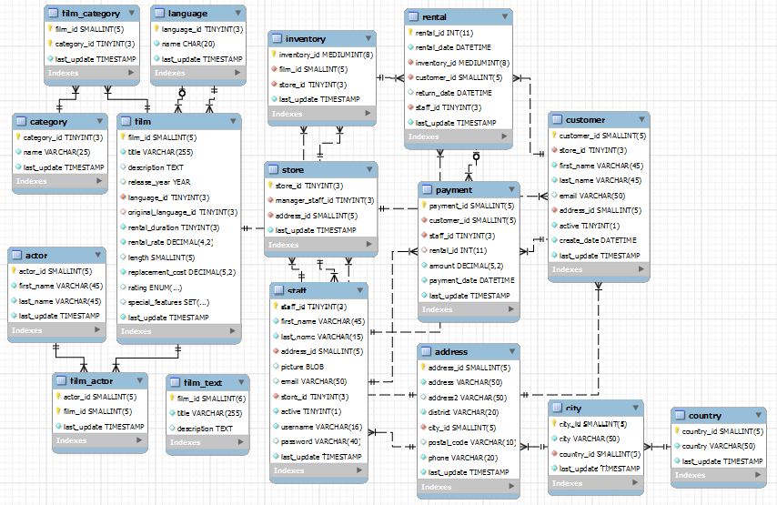

## Ejemplos de SQL
MySQL Sample Databases
======================

There are many excellent and interesting sample databases available, that you can use as a template (or pattern) to design your own databases.

### MySQL's Sample Employee Database

Reference: MySQL's Sample Employees Database @ [http://dev.mysql.com/doc/employee/en/index.html](http://dev.mysql.com/doc/employee/en/index.html).

This is a rather simple database with 6 tables but with millions of records.

#### Database and Tables

There are 6 tables as follows:

##### Table "employees"

    CREATE TABLE **employees** (
    emp\_no      INT             NOT NULL,  \-- UNSIGNED AUTO\_INCREMENT??
    birth\_date  DATE            NOT NULL,
    first\_name  VARCHAR(14)     NOT NULL,
    last\_name   VARCHAR(16)     NOT NULL,
    gender      ENUM ('M','F')  NOT NULL,  \-- Enumeration of either 'M' or 'F'  
    hire\_date   DATE            NOT NULL,
    PRIMARY KEY (emp\_no)                   \-- Index built automatically on primary-key column
                                           \-- INDEX (first\_name)
                                           -- INDEX (last\_name)
    );

There are 300,024 records for this table.

##### Table "departments"

    CREATE TABLE **departments** (
    dept\_no     CHAR(4)         NOT NULL,  \-- in the form of 'dxxx'
    dept\_name   VARCHAR(40)     NOT NULL,
    PRIMARY KEY (dept\_no),                 \-- Index built automatically
    UNIQUE  KEY (dept\_name)                \-- Build INDEX on this unique-value column
    );

The keyword `KEY` is synonym to `INDEX`. An `INDEX` can be built on unique-value column (`UNIQUE KEY` or `UNIQUE INDEX`) or non-unique-value column (`KEY` or `INDEX`). Indexes greatly facilitates fast search. However, they deplete the performance in `INSERT`, `UPDATE` and `DELETE`. Generally, relational databases are optimized for retrievals, and NOT for modifications.

There are 9 records for this table.

##### Table "dept\_emp"

Junction table to support between many-to-many relationship between `employees` and `departments`. A department has many employees. An employee can belong to different department at different dates, and possibly concurrently.

    CREATE TABLE **dept\_emp** (
    emp\_no      INT         NOT NULL,
    dept\_no     CHAR(4)     NOT NULL,
    from\_date   DATE        NOT NULL,
    to\_date     DATE        NOT NULL,
    KEY         (emp\_no),   \-- Build INDEX on this non-unique-value column
    KEY         (dept\_no),  \-- Build INDEX on this non-unique-value column
    FOREIGN KEY (emp\_no) REFERENCES employees (emp\_no) ON DELETE CASCADE,
           \-- Cascade DELETE from parent table 'employee' to this child table
           -- If an emp\_no is deleted from parent 'employee', all records
           --  involving this emp\_no in this child table are also deleted
           -- ON UPDATE CASCADE??
    FOREIGN KEY (dept\_no) REFERENCES departments (dept\_no) ON DELETE CASCADE,
           \-- ON UPDATE CASCADE??
    PRIMARY KEY (emp\_no, dept\_no)
           \-- Might not be unique?? Need to include from\_date
    );

The foreign keys have `ON DELETE` _reference action_ of `CASCADE`. If a record having a particular key-value from the parent table (employees and departments) is deleted, all the records in this child table having the same key-value are also deleted. Take note that the default `ON DELETE` reference action of is `RESTRICTED`, which disallows `DELETE` on the parent record, if there are matching records in the child table.

There are two reference actions: `ON DELETE` and `ON UPDATE`. The `ON UPDATE` reference action of is defaulted to `RESTRICT` (or disallow). It is more meaningful to set `ON UPDATE` to `CASCADE`, so that changes in parent table (e.g., change in `emp_no` and `dept_no`) can be cascaded down to the child table(s).

There are 331,603 records for this table.

##### Table "dept\_manager"

join table to support between many-to-many relationship between `employees` and `departments`. Same structure as `dept_emp`.

    CREATE TABLE **dept\_manager** (
    dept\_no      CHAR(4)  NOT NULL,
    emp\_no       INT      NOT NULL,
    from\_date    DATE     NOT NULL,
    to\_date      DATE     NOT NULL,
    KEY         (emp\_no),
    KEY         (dept\_no),
    FOREIGN KEY (emp\_no)  REFERENCES employees (emp\_no)    ON DELETE CASCADE,
                                   \-- ON UPDATE CASCADE??
    FOREIGN KEY (dept\_no) REFERENCES departments (dept\_no) ON DELETE CASCADE,
    PRIMARY KEY (emp\_no, dept\_no)  \-- might not be unique?? Need from\_date
    );

There are 24 records for this table.

##### Table "titles"

There is a one-to-many relationship between `employees` and `titles`. One employee has many titles (concurrently or at different dates). A `titles` record refers to one employee (via `emp_no`).

CREATE TABLE **titles** (
    emp\_no      INT          NOT NULL,
    title       VARCHAR(50)  NOT NULL,
    from\_date   DATE         NOT NULL,
    to\_date     DATE,
    KEY         (emp\_no),
    FOREIGN KEY (emp\_no) REFERENCES employees (emp\_no) ON DELETE CASCADE,
                         \-- ON UPDATE CASCADE??
    PRIMARY KEY (emp\_no, title, from\_date)
       \-- This ensures unique combination. 
       -- An employee may hold the same title but at different period
     );

There are 443,308 records for this table.

##### Table "salaries"

Similar structure to `titles` table. One-to-many relationship between `employees` and `salaries`.

CREATE TABLE **salaries** (
    emp\_no      INT    NOT NULL,
    salary      INT    NOT NULL,
    from\_date   DATE   NOT NULL,
    to\_date     DATE   NOT NULL,
    KEY         (emp\_no),
    FOREIGN KEY (emp\_no) REFERENCES employees (emp\_no) ON DELETE CASCADE,
    PRIMARY KEY (emp\_no, from\_date)
    );

There are 2,844,047 records for this table.

#### Stored Objects

No stored objects (view, procedure, function, trigger, event) defined. \[Shall try!\]

### MySQL's Sample Salika (DVD Rental) Database

Reference: MySQL's Sample Sakila Database @ [http://dev.mysql.com/doc/sakila/en/index.html](http://dev.mysql.com/doc/sakila/en/index.html).

The MySQL's Sample Salika (DVD Rental) Database can be downloaded from[http://dev.mysql.com/doc/sakila/en/index.html](http://dev.mysql.com/doc/sakila/en/index.html). It is a complex database with 16 tables. It also illustrates features such as Views, Stored Procedures and Triggers. This is probably the best sample available for studying MySQL databases.

#### Database and Tables

All the tables have `DEFAULT CHARSET` of `utf8` for internationalization support. All the tables, except `film_text`, use `InnoDB` engine, which supports foreign key and transaction. The table `film_text` uses `MyISAM` to support `FULLTEXT` search.

For UTF8 support, we could set the `DEFAULT CHARSET` at the database level as follows:

\-- Enable client program to communicate with the server using utf8 character set
    SET NAMES 'utf8';

    DROP DATABASE IF EXISTS \`sakila\`;
    \-- Set the default charset to utf8 for internationalization, use case-insensitive (ci) collation
CREATE DATABASE IF NOT EXISTS \`sakila\` DEFAULT CHARACTER SET utf8 COLLATE utf8\_unicode\_ci;
USE \`sakila\`;

We could use "`SHOW CREATE DATABASE _databaseName_ \G`" and "`SHOW CREATE TABLE _tableName_ \G`" to display all the defaults used in `CREATE DATABASE` and `CREATE TABLE`.

##### Table "actor"

    CREATE TABLE **actor** (
    actor\_id    SMALLINT     UNSIGNED NOT NULL AUTO\_INCREMENT,
                           \-- 16-bit unsigned int in the range of \[0, 65535\]
    first\_name  VARCHAR(45)  NOT NULL,
    last\_name   VARCHAR(45)  NOT NULL,
     last\_update TIMESTAMP    NOT NULL DEFAULT CURRENT\_TIMESTAMP ON UPDATE CURRENT\_TIMESTAMP,
    PRIMARY KEY (actor\_id),
    KEY idx\_actor\_last\_name (last\_name)   \-- To build index (non-unique) on last\_name
    ) ENGINE=InnoDB DEFAULT CHARSET=utf8;
       \-- Use InnoDB Engine, which supports foreign key and transaction
       -- Use Unicode 'utf8' character set for this table

*   There can be one `TIMESTAMP` column with `DEFAULT CURRENT_TIMESTAMP`. If you wish to have both `create` and `last_update`, you need to use a `ON INSERT` trigger to set the `create` `TIMESTAMP`. For strict auditing, you might have `create_timestamp`, `create_by`, `last_update_timestamp` and `last_update_by`.
*   InnoDB engine is used, which support foreign key and transaction.
*   The default character set for this table is UTF8, which supports all languages for internationalization.
*   Better to use `INT UNSIGNED` for `AUTO_INCREMENT` column `actor_id` to avoid overrun.

There are 200 records for this table.

##### Table "language"

Languages: such as English, Italian, Japanese, Mandrain, Cantonese, French, German.

CREATE TABLE **language** (
  language\_id  TINYINT    UNSIGNED NOT NULL AUTO\_INCREMENT,
                          \-- 8-bit unsigned int \[0, 255\]
  name         CHAR(20)   NOT NULL,
  last\_update  TIMESTAMP  NOT NULL DEFAULT CURRENT\_TIMESTAMP ON UPDATE CURRENT\_TIMESTAMP,
  PRIMARY KEY (language\_id)
) ENGINE=InnoDB DEFAULT CHARSET=utf8;

May be simpler to use an `ENUM` (one choice).

There are 6 records for this table, i.e., `'English'`, `'Italian'`, `'Japanese'`, `'Mandarin'`, `'French'`, `'German'`.

##### Table "film"

CREATE TABLE **film** (
  film\_id              SMALLINT     UNSIGNED NOT NULL AUTO\_INCREMENT,
  title                VARCHAR(255) NOT NULL,
  description          TEXT         DEFAULT NULL,       \-- Up to 64KB
  release\_year         YEAR         DEFAULT NULL,       \-- 'yyyy'
  language\_id          TINYINT      UNSIGNED NOT NULL,  \-- 8-bit unsigned int \[0, 255\]
  original\_language\_id TINYINT      UNSIGNED DEFAULT NULL,
  rental\_duration      TINYINT      UNSIGNED NOT NULL DEFAULT 3,
  rental\_rate          DECIMAL(4,2) NOT NULL DEFAULT 4.99,  
                                    -- DECIMAL is precise and ideal for currency \[99.99\]. UNSIGNED?
  length               SMALLINT     UNSIGNED DEFAULT NULL,  \-- 16-bit unsigned int \[0, 65535\]
  replacement\_cost     DECIMAL(5,2) NOT NULL DEFAULT 19.99, \-- \[999.99\], UNSIGNED??
  rating               ENUM('G','PG','PG-13','R','NC-17') DEFAULT 'G',
  special\_features     SET('Trailers','Commentaries','Deleted Scenes','Behind the Scenes') DEFAULT NULL,
                                    \-- Can take zero or more values from a SET
                                    -- But only one value from ENUM
  last\_update          TIMESTAMP    NOT NULL DEFAULT CURRENT\_TIMESTAMP ON UPDATE CURRENT\_TIMESTAMP,
  PRIMARY KEY (film\_id),
  KEY idx\_title (title),
  KEY idx\_fk\_language\_id (language\_id),
  KEY idx\_fk\_original\_language\_id (original\_language\_id),
        \-- To build index on title, language\_id, original\_language\_id and film\_id (primary key)
  CONSTRAINT fk\_film\_language FOREIGN KEY (language\_id) REFERENCES language (language\_id)
    ON DELETE RESTRICT ON UPDATE CASCADE,
        \-- Cannot delete parent record if there is any matching child record
        -- Update the matching child records if parent record is updated
  CONSTRAINT fk\_film\_language\_original FOREIGN KEY (original\_language\_id) REFERENCES language (language\_id)
    ON DELETE RESTRICT ON UPDATE CASCADE
) ENGINE=InnoDB DEFAULT CHARSET=utf8;

*   Instead of hard-coding the "language" and "original language", it uses `language_id` to look up the `language` table, in a one-to-one relationship. Could use an `ENUM` for language directly for simplicity.
*   `KEYs` (`INDEXes`) are defined on certain columns to facilitate fast search on these columns. We would use "`SHOW INDEX FROM _tableName_ \G`" to display the details on indexes.
*   Should include `UNSIGNED` for for non-negative numeric columns like `rental_rate`.

There are 1000 records for this table.

##### Table "film\_actor"

Junction table between `actor` and `film` to support the many-to-many relationship.

CREATE TABLE **film\_actor** (
  actor\_id     SMALLINT UNSIGNED NOT NULL,
  film\_id      SMALLINT UNSIGNED NOT NULL,
  last\_update  TIMESTAMP NOT NULL DEFAULT CURRENT\_TIMESTAMP ON UPDATE CURRENT\_TIMESTAMP,
  PRIMARY KEY  (actor\_id, film\_id),
  KEY idx\_fk\_film\_id (\`film\_id\`),
  CONSTRAINT fk\_film\_actor\_actor FOREIGN KEY (actor\_id) REFERENCES actor (actor\_id) 
    ON DELETE RESTRICT ON UPDATE CASCADE,
  CONSTRAINT fk\_film\_actor\_film FOREIGN KEY (film\_id) REFERENCES film (film\_id) 
    ON DELETE RESTRICT ON UPDATE CASCADE
) ENGINE=InnoDB DEFAULT CHARSET=utf8;

There are 5462 records for this table.

##### Table "category"

CREATE TABLE **category** (
  category\_id  TINYINT      UNSIGNED NOT NULL AUTO\_INCREMENT,
  name         VARCHAR(25)  NOT NULL,
  last\_update  TIMESTAMP    NOT NULL DEFAULT CURRENT\_TIMESTAMP ON UPDATE CURRENT\_TIMESTAMP,
  PRIMARY KEY  (category\_id)
) ENGINE=InnoDB DEFAULT CHARSET=utf8;

*   There are 16 records for this table, i.e., `'Action'`, `'Animation'`, `'Children'`, `'Classics'`, `'Comedy'`, `'Documentary'`, `'Drama'`, `'Family'`, `'Foreign'`, `'Games'`, `'Horror'`, `'Music'`, `'New'`, `'Sci-Fi'`, `'Sports'`, `'Travel'`.
*   May be better to use a `SET` to support multiple categories per film, if the number of categories is small. A `SET` is limited to 64 items in MySQL.

##### Table "film\_category"

Junction table to support many-to-many relationship between `film` and `category`.

CREATE TABLE **film\_category** (
  film\_id      SMALLINT   UNSIGNED NOT NULL,
  category\_id  TINYINT    UNSIGNED NOT NULL,
  last\_update  TIMESTAMP  NOT NULL DEFAULT CURRENT\_TIMESTAMP ON UPDATE CURRENT\_TIMESTAMP,
  PRIMARY KEY (film\_id, category\_id),
  CONSTRAINT fk\_film\_category\_film FOREIGN KEY (film\_id) REFERENCES film (film\_id) 
    ON DELETE RESTRICT ON UPDATE CASCADE,
  CONSTRAINT fk\_film\_category\_category FOREIGN KEY (category\_id) REFERENCES category (category\_id) 
    ON DELETE RESTRICT ON UPDATE CASCADE
) ENGINE=InnoDB DEFAULT CHARSET=utf8;

There are 1000 records for this table. Each of the 1000 films has ONE category.

##### Table "film\_text" - FULLTEXT Index and Search

CREATE TABLE **film\_text** (
  film\_id      SMALLINT      NOT NULL,
  title        VARCHAR(255)  NOT NULL,
  description  TEXT,
  PRIMARY KEY  (film\_id),
  FULLTEXT KEY idx\_title\_description (title, description)
     \-- To build index on FULLTEXT to facilitate text search
     -- FULLTEXT is supported in MyISAM engine, NOT in InnoDB engine
) ENGINE=MyISAM DEFAULT CHARSET=utf8;

*   This table duplicates information from `film` table, to support `FULLTEXT` search. That is, user can efficiently search all the words in `title` and `description` columns.
*   To ensure consistency between `film_text` and `film`, the rows are inserted/updated via a trigger on `film` table.
*   `FULLTEXT` search is supported in `MyISAM` engine only, not the `InnoDB` engine. A `FULLTEXT` index is build on columns `(title, description)`. You can perform `FULLTEXT` search on the index using "`WHERE MATCH(_columns_) AGAINST(_words_)`", for example,
    
    mysql> SELECT \* FROM film\_text
           WHERE MATCH(title, description) AGAINST ('great');
                 \-- search for the given word on the FULLTEXT index columns
     
    mysql> SELECT \* FROM film\_text 
           WHERE MATCH(title, description) AGAINST ('great good');  
                 \-- search for either 'great' or 'good'
     
    mysql> SELECT \* FROM film\_text 
           WHERE MATCH(title, description) AGAINST ('"very good"' IN BOOLEAN MODE);
                 \-- Use BOOLEAN MODE to match exact phrase (enclosed in double-quotes)
     
    mysql> SELECT \* FROM film\_text 
           WHERE MATCH(title, description) AGAINST ('+good \-bad' IN BOOLEAN MODE);
                 \-- Use BOOLEAN MODE to search for the word 'good', but NOT the word 'bad'
     
    mysql> SELECT \* FROM film\_text 
           WHERE MATCH(title, description) AGAINST ('great\*' IN BOOLEAN MODE);
                 \-- In BOOLEAN MODE, wildcard \* matches zero or more characters
     
    mysql> SELECT \* FROM film\_text 
           WHERE MATCH(title, description) AGAINST ('great' WITH QUERY EXPANSION);
                 \-- Do a second search on words in the most relevant rows from the first search
    

There are 1000 records for this table. Each `film` record has a `film_text` counterpart. The records in the `film_text` table is created via a `INSERT` trigger on the `film` table.

##### Table "inventory"

The company could have many copies of a particular film (in one store or many stores). Each copy is represented by an `inventory` record. The store is linked thru `store_id` to the table `store`.

CREATE TABLE **inventory** (
  inventory\_id  MEDIUMINT  UNSIGNED NOT NULL AUTO\_INCREMENT,
                           \-- Simpler to use INT UNSIGNED
  film\_id       SMALLINT   UNSIGNED NOT NULL,
  store\_id      TINYINT    UNSIGNED NOT NULL,
  last\_update   TIMESTAMP  NOT NULL DEFAULT CURRENT\_TIMESTAMP ON UPDATE CURRENT\_TIMESTAMP,
  PRIMARY KEY  (inventory\_id),
  KEY idx\_fk\_film\_id (film\_id),
  KEY idx\_store\_id\_film\_id (store\_id, film\_id),
  CONSTRAINT fk\_inventory\_store FOREIGN KEY (store\_id) REFERENCES store (store\_id) 
    ON DELETE RESTRICT ON UPDATE CASCADE,
  CONSTRAINT fk\_inventory\_film FOREIGN KEY (film\_id) REFERENCES film (film\_id) 
    ON DELETE RESTRICT ON UPDATE CASCADE
) ENGINE=InnoDB DEFAULT CHARSET=utf8;

There are 4581 records for this table.

##### Table "store"

Each store has a manager, linked thru `manager_staff_id` to the `staff` table. The address of the store is also linked thru `address_id` to the `address` table.

CREATE TABLE **store** (
  store\_id          TINYINT    UNSIGNED NOT NULL AUTO\_INCREMENT,
  manager\_staff\_id  TINYINT    UNSIGNED NOT NULL,
  address\_id        SMALLINT   UNSIGNED NOT NULL,
  last\_update       TIMESTAMP  NOT NULL DEFAULT CURRENT\_TIMESTAMP ON UPDATE CURRENT\_TIMESTAMP,
  PRIMARY KEY (store\_id),
  UNIQUE KEY idx\_unique\_manager (manager\_staff\_id),  \-- one manager manages only one store
  KEY idx\_fk\_address\_id (address\_id),
  CONSTRAINT fk\_store\_staff FOREIGN KEY (manager\_staff\_id) REFERENCES staff (staff\_id) 
    ON DELETE RESTRICT ON UPDATE CASCADE,
  CONSTRAINT fk\_store\_address FOREIGN KEY (address\_id) REFERENCES address (address\_id) 
    ON DELETE RESTRICT ON UPDATE CASCADE
) ENGINE=InnoDB DEFAULT CHARSET=utf8;

There are 2 records for this table.

##### Table "staff"

CREATE TABLE **staff** (
  staff\_id     TINYINT     UNSIGNED NOT NULL AUTO\_INCREMENT,
  first\_name   VARCHAR(45) NOT NULL,
  last\_name    VARCHAR(45) NOT NULL,
  address\_id   SMALLINT    UNSIGNED NOT NULL,
  picture      BLOB        DEFAULT NULL,           \-- Kept a picture as BLOB (up to 64KB)
  email        VARCHAR(50) DEFAULT NULL,
  store\_id     TINYINT     UNSIGNED NOT NULL,
  active       BOOLEAN     NOT NULL DEFAULT TRUE,  \-- BOOLEAN FALSE (0) TRUE (non-0)
  username     VARCHAR(16) NOT NULL,
  password     VARCHAR(40) BINARY DEFAULT NULL,    \-- BINARY??
  last\_update  TIMESTAMP   NOT NULL DEFAULT CURRENT\_TIMESTAMP ON UPDATE CURRENT\_TIMESTAMP,
  PRIMARY KEY  (staff\_id),
  KEY idx\_fk\_store\_id (store\_id),
  KEY idx\_fk\_address\_id (address\_id),
  CONSTRAINT fk\_staff\_store FOREIGN KEY (store\_id) REFERENCES store (store\_id)
    ON DELETE RESTRICT ON UPDATE CASCADE,
  CONSTRAINT fk\_staff\_address FOREIGN KEY (address\_id) REFERENCES address (address\_id)
    ON DELETE RESTRICT ON UPDATE CASCADE
) ENGINE=InnoDB DEFAULT CHARSET=utf8;

There are 2 records for this table, with pictures (BLOB) provided.

##### Table "customer"

CREATE TABLE **customer** (
  customer\_id  SMALLINT    UNSIGNED NOT NULL AUTO\_INCREMENT,
  store\_id     TINYINT     UNSIGNED NOT NULL,
  first\_name   VARCHAR(45) NOT NULL,
  last\_name    VARCHAR(45) NOT NULL,
  email        VARCHAR(50) DEFAULT NULL,
  address\_id   SMALLINT    UNSIGNED NOT NULL,
  active       BOOLEAN     NOT NULL DEFAULT TRUE,
  create\_date  DATETIME    NOT NULL,
  last\_update  TIMESTAMP   DEFAULT CURRENT\_TIMESTAMP ON UPDATE CURRENT\_TIMESTAMP,
  PRIMARY KEY  (customer\_id),
  KEY idx\_fk\_store\_id (store\_id),
  KEY idx\_fk\_address\_id (address\_id),
  KEY idx\_last\_name (last\_name),
  CONSTRAINT fk\_customer\_address FOREIGN KEY (address\_id) REFERENCES address (address\_id)
    ON DELETE RESTRICT ON UPDATE CASCADE,
  CONSTRAINT fk\_customer\_store FOREIGN KEY (store\_id) REFERENCES store (store\_id)
    ON DELETE RESTRICT ON UPDATE CASCADE
) ENGINE=InnoDB DEFAULT CHARSET=utf8;

There are 599 records for this table.

##### Table "rental"

Rental rate is kept in the `film` table.

CREATE TABLE **rental** (
  rental\_id     INT        NOT NULL AUTO\_INCREMENT,
  rental\_date   DATETIME   NOT NULL,
  inventory\_id  MEDIUMINT  UNSIGNED NOT NULL,
  customer\_id   SMALLINT   UNSIGNED NOT NULL,
  return\_date   DATETIME   DEFAULT NULL,
  staff\_id      TINYINT    UNSIGNED NOT NULL,
  last\_update   TIMESTAMP  NOT NULL DEFAULT CURRENT\_TIMESTAMP ON UPDATE CURRENT\_TIMESTAMP,
  PRIMARY KEY (rental\_id),
  UNIQUE KEY  (rental\_date, inventory\_id, customer\_id),
  KEY idx\_fk\_inventory\_id (inventory\_id),
  KEY idx\_fk\_customer\_id (customer\_id),
  KEY idx\_fk\_staff\_id (staff\_id),
  CONSTRAINT fk\_rental\_staff FOREIGN KEY (staff\_id) REFERENCES staff (staff\_id)
    ON DELETE RESTRICT ON UPDATE CASCADE,
  CONSTRAINT fk\_rental\_inventory FOREIGN KEY (inventory\_id) REFERENCES inventory (inventory\_id)
    ON DELETE RESTRICT ON UPDATE CASCADE,
  CONSTRAINT fk\_rental\_customer FOREIGN KEY (customer\_id) REFERENCES customer (customer\_id)
    ON DELETE RESTRICT ON UPDATE CASCADE
) ENGINE=InnoDB DEFAULT CHARSET=utf8;

There are 16,044 records for this table.

##### Table "payment"

An rental can have multiple payments?

CREATE TABLE **payment** (
  payment\_id    SMALLINT     UNSIGNED NOT NULL AUTO\_INCREMENT,
  customer\_id   SMALLINT     UNSIGNED NOT NULL,
  staff\_id      TINYINT      UNSIGNED NOT NULL,
  rental\_id     INT          DEFAULT NULL,
  amount        DECIMAL(5,2) NOT NULL,
  payment\_date  DATETIME     NOT NULL,
  last\_update   TIMESTAMP    DEFAULT CURRENT\_TIMESTAMP ON UPDATE CURRENT\_TIMESTAMP,
  PRIMARY KEY  (payment\_id),
  KEY idx\_fk\_staff\_id (staff\_id),
  KEY idx\_fk\_customer\_id (customer\_id),
  CONSTRAINT fk\_payment\_rental FOREIGN KEY (rental\_id) REFERENCES rental (rental\_id)
    ON DELETE SET NULL ON UPDATE CASCADE,
  CONSTRAINT fk\_payment\_customer FOREIGN KEY (customer\_id) REFERENCES customer (customer\_id)
    ON DELETE RESTRICT ON UPDATE CASCADE,
  CONSTRAINT fk\_payment\_staff FOREIGN KEY (staff\_id) REFERENCES staff (staff\_id)
    ON DELETE RESTRICT ON UPDATE CASCADE
) ENGINE=InnoDB DEFAULT CHARSET=utf8;

There are 16,049 records for this table, more than `rental` table.

##### Table "address"

It is unlikely that two persons share the same address. Address is often a required field for a rental transaction. So it is probably better to store directly inside the `customers` table.

CREATE TABLE **address** (
  address\_id   SMALLINT    UNSIGNED NOT NULL AUTO\_INCREMENT,
  address      VARCHAR(50) NOT NULL,
  address2     VARCHAR(50) DEFAULT NULL,
  district     VARCHAR(20) NOT NULL,
  city\_id      SMALLINT    UNSIGNED NOT NULL,
  postal\_code  VARCHAR(10) DEFAULT NULL,
  phone        VARCHAR(20) NOT NULL,
  last\_update  TIMESTAMP   NOT NULL DEFAULT CURRENT\_TIMESTAMP ON UPDATE CURRENT\_TIMESTAMP,
  PRIMARY KEY  (address\_id),
  KEY idx\_fk\_city\_id (city\_id),
  CONSTRAINT \`fk\_address\_city\` FOREIGN KEY (city\_id) REFERENCES city (city\_id)
    ON DELETE RESTRICT ON UPDATE CASCADE
) ENGINE=InnoDB DEFAULT CHARSET=utf8;

There are 603 records for this table.

##### Table "city"

CREATE TABLE **city** (
  city\_id      SMALLINT    UNSIGNED NOT NULL AUTO\_INCREMENT,
  city         VARCHAR(50) NOT NULL,
  country\_id   SMALLINT    UNSIGNED NOT NULL,
  last\_update  TIMESTAMP   NOT NULL DEFAULT CURRENT\_TIMESTAMP ON UPDATE CURRENT\_TIMESTAMP,
  PRIMARY KEY  (city\_id),
  KEY idx\_fk\_country\_id (country\_id),
  CONSTRAINT \`fk\_city\_country\` FOREIGN KEY (country\_id) REFERENCES country (country\_id)
    ON DELETE RESTRICT ON UPDATE CASCADE
) ENGINE=InnoDB DEFAULT CHARSET=utf8;

There are 600 records for this table.

##### Table "country"

Having a `country` table may facilitate the creation of pull-down menu. Alternatively, you could consider using an `ENUM` (number of countries may exceed `ENUM`'s limit). For `city`, there are just too many cities in the world that the list can never be exhaustive. Probably better to keep inside the `address` table.

CREATE TABLE **country** (
  country\_id   SMALLINT    UNSIGNED NOT NULL AUTO\_INCREMENT,
  country      VARCHAR(50) NOT NULL,
  last\_update  TIMESTAMP   NOT NULL DEFAULT CURRENT\_TIMESTAMP ON UPDATE CURRENT\_TIMESTAMP,
  PRIMARY KEY  (country\_id)
) ENGINE=InnoDB DEFAULT CHARSET=utf8;

There are 109 records for this table.

#### Views

A `VIEW` is a virtual table (without data) that provides an alternate way to look at the data. It could be a consolidated set of columns from multiple table, or include derived column (such as total price).

We could use "`SHOW CREATE VIEW _viewName_ \G`" to show all the defaults.

##### View "staff\_list"

CREATE VIEW **staff\_list**
AS
SELECT 
  s.staff\_id AS ID,
  CONCAT(s.first\_name, \_utf8' ', s.last\_name) AS name,
  a.address AS address,
  a.postal\_code AS \`zip code\`,
  a.phone AS phone,
  city.city AS city,
  country.country AS country,
  s.store\_id AS SID
FROM staff AS s 
  JOIN address AS a ON s.address\_id = a.address\_id
  JOIN city ON a.city\_id = city.city\_id
  JOIN country ON city.country\_id = country.country\_id;

*   String literal can be expressed with optional introducer and collation in the form of:
    
    \-- Syntax
    \[\__charsetName_\]'_stringLiteral_' \[COLLATE _collationName_\]
     
    \-- Example
    SELECT \_utf8' ';   \-- space in UTF8
    

For Example,

mysql> **SELECT \* FROM staff\_list;**
+----+--------------+----------------------+----------+-------------+------------+-----------+-----+
| ID | name         | address              | zip code | phone       | city       | country   | SID |
+----+--------------+----------------------+----------+-------------+------------+-----------+-----+
|  1 | Mike Hillyer | 23 Workhaven Lane    |          | 14033335568 | Lethbridge | Canada    |   1 |
|  2 | Jon Stephens | 1411 Lillydale Drive |          | 6172235589  | Woodridge  | Australia |   2 |
+----+--------------+----------------------+----------+-------------+------------+-----------+-----+

##### View "customer\_list"

CREATE VIEW **customer\_list**
AS
SELECT 
  cu.customer\_id AS ID,
  CONCAT(cu.first\_name, \_utf8' ', cu.last\_name) AS name,
  a.address AS address,
  a.postal\_code AS \`zip code\`,
  a.phone AS phone,
  city.city AS city,
  country.country AS country,
  IF(cu.active, \_utf8'active', \_utf8'') AS notes,
  cu.store\_id AS SID
FROM customer AS cu 
  JOIN address AS a ON cu.address\_id = a.address\_id
  JOIN city ON a.city\_id = city.city\_id
  JOIN country ON city.country\_id = country.country\_id;

##### View "film\_list"

CREATE VIEW **film\_list**
AS
SELECT 
  film.film\_id AS FID,
  film.title AS title,
  film.description AS description,
  category.name AS category,
  film.rental\_rate AS price,
  film.length AS length,
  film.rating AS rating,
  GROUP\_CONCAT(CONCAT(actor.first\_name, \_utf8' ', actor.last\_name) SEPARATOR ', ') AS actors
FROM category 
  LEFT JOIN film\_category ON category.category\_id = film\_category.category\_id
  LEFT JOIN film ON film\_category.film\_id = film.film\_id
  JOIN film\_actor ON film.film\_id = film\_actor.film\_id
  JOIN actor ON film\_actor.actor\_id = actor.actor\_id
GROUP BY film.film\_id;

*   The `GROUP_CONCAT(_col_ SEPARATOR _str_)` `GROUP BY` aggregate function can be used to produce a concatenate string for each group returned by the `GROUP BY` clause. Each `film_id` (in `GROUP BY`) has many actors.
*   For example,
    
    mysql> SELECT \* FROM film\_list LIMIT 1 \\G
    \*\*\*\*\*\*\*\*\*\*\*\*\*\*\*\*\*\*\*\*\*\*\*\*\*\*\* 1. row \*\*\*\*\*\*\*\*\*\*\*\*\*\*\*\*\*\*\*\*\*\*\*\*\*\*\*
            FID: 1
          title: ACADEMY DINOSAUR
    description: A Epic Drama of a Feminist And a Mad Scientist who must Battle
                 a Teacher in The Canadian Rockies
       category: Documentary
          price: 0.99
         length: 86
         rating: PG
         actors: PENELOPE GUINESS, CHRISTIAN GABLE, LUCILLE TRACY, SANDRA PECK, JOHNNY CAGE,
                 MENA TEMPLE, WARREN NOLTE, OPRAH KILMER, ROCK DUKAKIS, MARY KEITEL
    

##### View "nicer\_but\_slower\_film\_list"

CREATE VIEW **nicer\_but\_slower\_film\_list**
AS
SELECT 
  film.film\_id AS FID,
  film.title AS title,
  film.description AS description,
  category.name AS category,
  film.rental\_rate AS price,
  film.length AS length,
  film.rating AS rating,
  GROUP\_CONCAT(
    CONCAT(
       CONCAT(UCASE(SUBSTR(actor.first\_name, 1, 1)),   \-- first\_name initial-cap
              LCASE(SUBSTR(actor.first\_name, 2, LENGTH(actor.first\_name))),
       \_utf8' ',                                       \-- space
       CONCAT(UCASE(SUBSTR(actor.last\_name, 1, 1)),    \-- last\_name initial-cap
              LCASE(SUBSTR(actor.last\_name, 2, LENGTH(actor.last\_name))))))  \-- end of outer CONCAT
    SEPARATOR ', ') AS actors
FROM category 
  LEFT JOIN film\_category ON category.category\_id = film\_category.category\_id 
  LEFT JOIN film ON film\_category.film\_id = film.film\_id
  JOIN film\_actor ON film.film\_id = film\_actor.film\_id
  JOIN actor ON film\_actor.actor\_id = actor.actor\_id
GROUP BY film.film\_id;

*   The complex `CONCAT()` is used to produce camel-case (initial-capitalized) for the `first_name` and `last_name`, e.g., "Penelope Guiness".
*   `LENGTH(_str_)` returns the length of the string.
*   `SUBSTR(_str_, _fromIndex_, _length_)` returns the substring from index of length (index begins at 1).
*   `UCASE(_str_)` and `LCASE(_str_)` returns the uppercase and lowercase.
*   This view is exactly the same as `film_list` view. Why is it called `nicer_but_slower_film_list`?

##### View "sales\_by\_store"

CREATE VIEW **sales\_by\_store**
AS
SELECT
  CONCAT(c.city, \_utf8',', cy.country) AS store,
  CONCAT(m.first\_name, \_utf8' ', m.last\_name) AS manager,
  SUM(p.amount) AS total\_sales
FROM payment AS p
  INNER JOIN rental AS r ON p.rental\_id = r.rental\_id
  INNER JOIN inventory AS i ON r.inventory\_id = i.inventory\_id
  INNER JOIN store AS s ON i.store\_id = s.store\_id
  INNER JOIN address AS a ON s.address\_id = a.address\_id
  INNER JOIN city AS c ON a.city\_id = c.city\_id
  INNER JOIN country AS cy ON c.country\_id = cy.country\_id
  INNER JOIN staff AS m ON s.manager\_staff\_id = m.staff\_id
GROUP BY s.store\_id
ORDER BY cy.country, c.city;

The `SUM()` `GROUP BY` aggregate function applies to each group of `store_id`, i.e., per store.

For example,

+---------------------+--------------+-------------+
| store               | manager      | total\_sales |
+---------------------+--------------+-------------+
| Woodridge,Australia | Jon Stephens |    33726.77 |
| Lethbridge,Canada   | Mike Hillyer |    33679.79 |
+---------------------+--------------+-------------+

##### View "sales\_by\_film\_category"

CREATE VIEW **sales\_by\_film\_category**
AS
SELECT
  c.name AS category,
  SUM(p.amount) AS total\_sales
FROM payment AS p
  INNER JOIN rental AS r ON p.rental\_id = r.rental\_id
  INNER JOIN inventory AS i ON r.inventory\_id = i.inventory\_id
  INNER JOIN film AS f ON i.film\_id = f.film\_id
  INNER JOIN film\_category AS fc ON f.film\_id = fc.film\_id
  INNER JOIN category AS c ON fc.category\_id = c.category\_id
GROUP BY c.name
ORDER BY total\_sales DESC;

The `GROUP BY` aggregate function `SUM()` applies to each group of `c.name`, i.e., per `category`'s `name`.

##### View "actor\_info"

CREATE 
  DEFINER=CURRENT\_USER
  SQL SECURITY INVOKER
  VIEW **actor\_info**
AS
SELECT
  a.actor\_id,
  a.first\_name,
  a.last\_name,
  GROUP\_CONCAT(
     DISTINCT
     CONCAT(c.name, ': ',
        (SELECT 
           GROUP\_CONCAT(f.title ORDER BY f.title SEPARATOR ', ')
           FROM sakila.film f
           INNER JOIN sakila.film\_category fc ON f.film\_id = fc.film\_id
           INNER JOIN sakila.film\_actor fa ON f.film\_id = fa.film\_id
           WHERE fc.category\_id = c.category\_id AND fa.actor\_id = a.actor\_id)
        )  \-- end CONCAT
     ORDER BY c.name
     SEPARATOR '; ') AS film\_info
FROM sakila.actor a
LEFT JOIN sakila.film\_actor fa ON a.actor\_id = fa.actor\_id
LEFT JOIN sakila.film\_category fc ON fa.film\_id = fc.film\_id
LEFT JOIN sakila.category c ON fc.category\_id = c.category\_id
GROUP BY
  a.actor\_id,
  a.first\_name,
  a.last\_name;

*   `SQL SECURITY INVOKER` specifies that the it executes with the privileges of the user who invoke it (instead of the `DEFINER`).
*   `GROUP_CONCAT([DISTINCT] _col_ [ORDER BY ...] [SEPARATOR ...])`: You can apply optional `DISTINCT` and `ORDER BY` to `GROUP_CONCAT()`.
*   For example,
    
    mysql> **SELECT \* FROM actor\_info LIMIT 1 \\G**
    \*\*\*\*\*\*\*\*\*\*\*\*\*\*\*\*\*\*\*\*\*\*\*\*\*\*\* 1. row \*\*\*\*\*\*\*\*\*\*\*\*\*\*\*\*\*\*\*\*\*\*\*\*\*\*\*
      actor\_id: 1
    first\_name: PENELOPE
     last\_name: GUINESS
     film\_info: Animation: ANACONDA CONFESSIONS;
                Children: LANGUAGE COWBOY;
                Classics: COLOR PHILADELPHIA, WESTWARD SEABISCUIT;
                ......
    

#### Stored Routines: Procedures and Functions

##### Procedure "rewards\_report"

\-- Change the MySQL statement delimiter to // as it crashes with procedure's delimiter ';'
DELIMITER //
 
CREATE PROCEDURE **rewards\_report** (
   IN min\_monthly\_purchases TINYINT UNSIGNED,              \-- min number of purchases
   IN min\_dollar\_amount\_purchased DECIMAL(10,2) UNSIGNED,  -- min dollar amount purchased
   OUT count\_rewardees INT                                 \-- number of customers to be rewarded
)
LANGUAGE SQL
NOT DETERMINISTIC
READS SQL DATA
SQL SECURITY DEFINER
COMMENT 'Provides a customizable report on best customers'
 
proc: BEGIN
   DECLARE last\_month\_start DATE;
   DECLARE last\_month\_end DATE;

   /\* Some sanity checks... \*/
   IF min\_monthly\_purchases = 0 THEN
      SELECT 'Minimum monthly purchases parameter must be > 0';
      LEAVE proc;
   END IF;
   IF min\_dollar\_amount\_purchased = 0.00 THEN
      SELECT 'Minimum monthly dollar amount purchased parameter must be > $0.00';
      LEAVE proc;
   END IF;
 
   /\* Determine start and end time periods \*/
   SET last\_month\_start = DATE\_SUB(CURRENT\_DATE(), INTERVAL 1 MONTH);
   SET last\_month\_start = STR\_TO\_DATE(
                             CONCAT(YEAR(last\_month\_start), '-', MONTH(last\_month\_start), '-01'),
                             '%Y-%m-%d');
   SET last\_month\_end = LAST\_DAY(last\_month\_start);

   /\* Create a temporary storage area for Customer IDs \*/
   CREATE TEMPORARY TABLE tmpCustomer (customer\_id SMALLINT UNSIGNED NOT NULL PRIMARY KEY);

   /\* Find all customers meeting the monthly purchase requirements \*/
   INSERT INTO tmpCustomer (customer\_id)
     SELECT p.customer\_id
     FROM payment AS p
     WHERE DATE(p.payment\_date) BETWEEN last\_month\_start AND last\_month\_end
     GROUP BY customer\_id
     HAVING 
       SUM(p.amount) > min\_dollar\_amount\_purchased
       AND COUNT(customer\_id) > min\_monthly\_purchases;

   /\* Populate OUT parameter with count of found customers \*/
   SELECT COUNT(\*) FROM tmpCustomer INTO count\_rewardees;

   /\* Output ALL customer information of matching rewardees.
      Customize output as needed. \*/
   SELECT c.\*
     FROM tmpCustomer AS t
     INNER JOIN customer AS c ON t.customer\_id = c.customer\_id;

   /\* Clean up \*/
   DROP TABLE tmpCustomer;
END //
 
\-- Change the MySQL delimiter back to ';'
DELIMITER ;

To test the procedure,

mysql> CALL rewards\_report(2, 10, @numRewardees);

mysel> SELECT @numRewardees;

##### Function "get\_customer\_balance"

DELIMITER $$
 
CREATE FUNCTION **get\_customer\_balance**(p\_customer\_id INT, p\_effective\_date DATETIME) RETURNS DECIMAL(5,2)
   DETERMINISTIC
   READS SQL DATA
BEGIN
   \# OK, WE NEED TO CALCULATE THE CURRENT BALANCE GIVEN A CUSTOMER\_ID AND A DATE
   # THAT WE WANT THE BALANCE TO BE EFFECTIVE FOR. THE BALANCE IS:
   #   1) RENTAL FEES FOR ALL PREVIOUS RENTALS
   #   2) ONE DOLLAR FOR EVERY DAY THE PREVIOUS RENTALS ARE OVERDUE
   #   3) IF A FILM IS MORE THAN RENTAL\_DURATION \* 2 OVERDUE, CHARGE THE REPLACEMENT\_COST
   #   4) SUBTRACT ALL PAYMENTS MADE BEFORE THE DATE SPECIFIED

   DECLARE v\_rentfees DECIMAL(5,2);  \# FEES PAID TO RENT THE VIDEOS INITIALLY
   DECLARE v\_overfees INTEGER;       \# LATE FEES FOR PRIOR RENTALS
   DECLARE v\_payments DECIMAL(5,2);  \# SUM OF PAYMENTS MADE PREVIOUSLY

   SELECT IFNULL(SUM(film.rental\_rate), 0) INTO v\_rentfees
     FROM film, inventory, rental
     WHERE film.film\_id = inventory.film\_id
      AND inventory.inventory\_id = rental.inventory\_id
      AND rental.rental\_date <= p\_effective\_date
      AND rental.customer\_id = p\_customer\_id;
 
   SELECT IFNULL(
             SUM(
                IF((TO\_DAYS(rental.return\_date) - TO\_DAYS(rental.rental\_date)) > film.rental\_duration,
                   ((TO\_DAYS(rental.return\_date) - TO\_DAYS(rental.rental\_date)) - film.rental\_duration), 0)),
             0)
          INTO v\_overfees
   FROM rental, inventory, film
   WHERE film.film\_id = inventory.film\_id
      AND inventory.inventory\_id = rental.inventory\_id
      AND rental.rental\_date <= p\_effective\_date
      AND rental.customer\_id = p\_customer\_id;
 
   SELECT IFNULL(SUM(payment.amount), 0) INTO v\_payments
   FROM payment
   WHERE payment.payment\_date <= p\_effective\_date
      AND payment.customer\_id = p\_customer\_id;
 
   RETURN v\_rentfees + v\_overfees - v\_payments;
END $$
DELIMITER ;

##### Procedure "film\_in\_stock"

DELIMITER $$
\-- Given the film\_id and store\_id, find the film count
CREATE PROCEDURE **film\_in\_stock**(
   IN  p\_film\_id INT,
   IN  p\_store\_id INT,
   OUT p\_film\_count INT)
READS SQL DATA
BEGIN
   SELECT inventory\_id
     FROM inventory
     WHERE film\_id = p\_film\_id
       AND store\_id = p\_store\_id
       AND inventory\_in\_stock(inventory\_id);
 
   SELECT FOUND\_ROWS() INTO p\_film\_count;
END $$
DELIMITER ;

##### Procedure "film\_not\_in\_stock"

DELIMITER $$
CREATE PROCEDURE **film\_not\_in\_stock**(IN p\_film\_id INT, IN p\_store\_id INT, OUT p\_film\_count INT)
READS SQL DATA
BEGIN
   SELECT inventory\_id
   FROM inventory
   WHERE film\_id = p\_film\_id
   AND store\_id = p\_store\_id
   AND NOT inventory\_in\_stock(inventory\_id);
 
   SELECT FOUND\_ROWS() INTO p\_film\_count;
END $$
DELIMITER ;

##### Function "inventory\_held\_by\_customer"

DELIMITER $$
CREATE FUNCTION **inventory\_held\_by\_customer**(p\_inventory\_id INT) RETURNS INT
READS SQL DATA
BEGIN
   DECLARE v\_customer\_id INT;
   DECLARE EXIT HANDLER FOR NOT FOUND RETURN NULL;

   SELECT customer\_id INTO v\_customer\_id
   FROM rental
   WHERE return\_date IS NULL AND inventory\_id = p\_inventory\_id;

   RETURN v\_customer\_id;
END $$
DELIMITER ;

##### Function "inventory\_in\_stock"

DELIMITER $$
CREATE FUNCTION **inventory\_in\_stock**(p\_inventory\_id INT) RETURNS BOOLEAN
READS SQL DATA
BEGIN
   DECLARE v\_rentals INT;
   DECLARE v\_out     INT;

   \# AN ITEM IS IN-STOCK IF THERE ARE EITHER NO ROWS IN THE rental TABLE
   # FOR THE ITEM OR ALL ROWS HAVE return\_date POPULATED
   SELECT COUNT(\*) INTO v\_rentals
   FROM rental
   WHERE inventory\_id = p\_inventory\_id;
 
   IF v\_rentals = 0 THEN
      RETURN TRUE;
   END IF;
 
   SELECT COUNT(rental\_id) INTO v\_out
   FROM inventory LEFT JOIN rental USING(inventory\_id)
   WHERE inventory.inventory\_id = p\_inventory\_id AND rental.return\_date IS NULL;
 
   IF v\_out > 0 THEN
      RETURN FALSE;
   ELSE
      RETURN TRUE;
   END IF;
END $$
DELIMITER ;

#### Triggers

The `film_text` table duplicates information from `film` table to build a `FULLTEXT` search index. To ensure consistency between the two tables, triggers are used for `INSERT`, `UPDATE` and `DELETE` on each row of `film` table, that perform corresponding actions in the `film_text` table.

##### Trigger "ins\_film"

DELIMITER $$
\-- Trigger for INSERT INTO film table
-- Copy information to film\_text table
CREATE TRIGGER \`**ins\_film**\` AFTER INSERT ON \`film\` FOR EACH ROW 
BEGIN
   INSERT INTO film\_text (film\_id, title, description)
      VALUES (new.film\_id, new.title, new.description);
END$$
DELIMITER ;

##### Trigger "upd\_film"

\-- Trigger for UPDATE film table
-- Update the film\_text table
DELIMITER $$
CREATE TRIGGER \`**upd\_film**\` AFTER UPDATE ON \`film\` FOR EACH ROW 
BEGIN
   IF (old.title != new.title) or (old.description != new.description)
   THEN
      UPDATE film\_text
      SET title=new.title,
          description=new.description,
          film\_id=new.film\_id
      WHERE film\_id=old.film\_id;
   END IF;
END$$
DELIMITER ;

##### Trigger "del\_film"

\-- Trigger for DELECT FROM film table
-- DELETE from film\_text table as well
DELIMITER $$
CREATE TRIGGER \`**del\_film**\` AFTER DELETE ON \`film\` FOR EACH ROW 
BEGIN
   DELETE FROM film\_text WHERE film\_id = old.film\_id;
END$$
DELIMITER ;

### Microsoft Northwind Trader Database

For MS SQL Server, you can download the Northwind database from "[Northwind and Pubs Sample Databases for SQL Server 2000](http://www.microsoft.com/en-us/download/details.aspx?id=23654)". Run the downloaded "`.msi`" file, it will extract the files into "`C:\SQL Server 2000 Sample Databases`". The SQL statements are kept in "`instnwnd.sql`".

For MS Access ⇒ Launch Access ⇒ Choose "Sample" ⇒ Northwind Sample Database ⇒ Download.

There are various MySQL ports available. For example, "northwindextended" project @ [http://code.google.com/p/northwindextended](http://code.google.com/p/northwindextended).

#### Database and Tables

There are 13 tables as follows:

##### Table "Customers"

CREATE TABLE \`**Customers**\` (
   \`CustomerID\`   VARCHAR(5)   NOT NULL,
       \-- First 5 letters of CompanyName
       -- Probably better to use an UNSIGNED INT
   \`CompanyName\`  VARCHAR(40)  NOT NULL,
   \`ContactName\`  VARCHAR(30),
   \`ContactTitle\` VARCHAR(30),
   \`Address\`      VARCHAR(60),
   \`City\`         VARCHAR(15),
   \`Region\`       VARCHAR(15),
   \`PostalCode\`   VARCHAR(10),
   \`Country\`      VARCHAR(15),
   \`Phone\`        VARCHAR(24),
   \`Fax\`          VARCHAR(24),
   PRIMARY KEY (\`CustomerID\`),
   INDEX (\`City\`),
   INDEX (\`CompanyName\`),
   INDEX (\`PostalCode\`),
   INDEX (\`Region\`)
       \-- Build indexes on these columns for fast search
);

There are 93 records for this table.

##### Table "Employees"

CREATE TABLE \`**Employees**\` (
   \`EmployeeID\`      MEDIUMINT UNSIGNED  NOT NULL AUTO\_INCREMENT,
                     \-- \[0, 65535\]
   \`LastName\`        VARCHAR(20)         NOT NULL,
   \`FirstName\`       VARCHAR(10)         NOT NULL,
   \`Title\`           VARCHAR(30),  \-- e.g., 'Sales Coordinator'
   \`TitleOfCourtesy\` VARCHAR(25),  \-- e.g., 'Mr.' 'Ms.' (ENUM??)
   \`BirthDate\`       DATE,         \-- 'YYYY-MM-DD'
   \`HireDate\`        DATE,
   \`Address\`         VARCHAR(60),
   \`City\`            VARCHAR(15),
   \`Region\`          VARCHAR(15),
   \`PostalCode\`      VARCHAR(10),
   \`Country\`         VARCHAR(15),
   \`HomePhone\`       VARCHAR(24),
   \`Extension\`       VARCHAR(4),
   \`Photo\`           BLOB,                          \-- 64KB
   \`Notes\`           TEXT                NOT NULL,  \-- 64KB
   \`ReportsTo\`       MEDIUMINT UNSIGNED  NULL,  \-- Manager's ID
                                                -- Allow NULL for boss
   \`PhotoPath\`       VARCHAR(255),
   \`Salary\`          INT,
   INDEX (\`LastName\`),
   INDEX (\`PostalCode\`),
   PRIMARY KEY (\`EmployeeID\`),
   FOREIGN KEY (\`ReportsTo\`) REFERENCES \`Employees\` (\`EmployeeID\`)
);

To load this table with the sample data provided, you need to move the second record as the first record and hardcode the `employeeID`. There are 9 records for this table. The photos are included as hex data.

To list the worker names under the manager names, you need to join the `employee` table to itself. Use `LEFT JOIN` to retrieve `ReportsTo` of `NULL`.

\-- List the worker names under the managers' ID
SELECT reportsTo AS \`Manager ID\`, CONCAT(employees.FirstName, ' ', employees.LastName) AS \`Workers\`
FROM employees
ORDER BY reportsTo;
+------------+------------------+
| Manager ID | Workers          |
+------------+------------------+
|       NULL | Andrew Fuller    |
|          2 | Nancy Davolio    |
|          2 | Janet Leverling  |
|          2 | Margaret Peacock |
|          2 | Steven Buchanan  |
|          2 | Laura Callahan   |
|          5 | Michael Suyama   |
|          5 | Robert King      |
|          5 | Anne Dodsworth   |
+------------+------------------+
 
\-- List the worker name under the managers' name
-- Need to use a LEFT JOIN
SELECT
  CONCAT(managers.FirstName, ' ', managers.LastName) AS \`Managers\`, 
  CONCAT(employees.FirstName, ' ', employees.LastName) AS \`Workers\`
FROM
  employees LEFT JOIN employees AS managers ON employees.ReportsTo = managers.employeeID
ORDER BY
  managers.employeeID;
+-----------------+------------------+
| Managers        | Workers          |
+-----------------+------------------+
| NULL            | Andrew Fuller    |
| Andrew Fuller   | Margaret Peacock |
| Andrew Fuller   | Laura Callahan   |
| Andrew Fuller   | Nancy Davolio    |
| Andrew Fuller   | Steven Buchanan  |
| Andrew Fuller   | Janet Leverling  |
| Steven Buchanan | Robert King      |
| Steven Buchanan | Anne Dodsworth   |
| Steven Buchanan | Michael Suyama   |
+-----------------+------------------+

##### Table "Region"

CREATE TABLE \`**Region**\` (
   \`RegionID\`           TINYINT UNSIGNED  NOT NULL AUTO\_INCREMENT,
                        \-- \[0,255\]
   \`RegionDescription\`  VARCHAR(50)       NOT NULL,
                        \-- e.g., 'Eastern','Western','Northern','Southern'
                        -- Could use an ENUM and eliminate this table
   PRIMARY KEY (\`RegionID\`)
);

There are 4 records for this table (`'Eastern'`, `'Western'`, `'Northern'`, `'Southern'`).

##### Table "Territories"

\-- e.g., ('02116', 'Boston', 1)
CREATE TABLE \`**Territories**\` (
   \`TerritoryID\`           VARCHAR(20)       NOT NULL,  \-- ZIP code
   \`TerritoryDescription\`  VARCHAR(50)       NOT NULL,  \-- Name
   \`RegionID\`              TINYINT UNSIGNED  NOT NULL,
                           \-- Could use an ENUM to eliminate \`Region\` table
   PRIMARY KEY (\`TerritoryID\`),
   FOREIGN KEY (\`RegionID\`) REFERENCES \`Region\` (\`RegionID\`)
);

There are 53 records for this table.

##### Table "EmployeeTerritories"

\-- Many-to-many Junction table between Employee and Territory
CREATE TABLE \`**EmployeeTerritories**\` (
   \`EmployeeID\`  MEDIUMINT UNSIGNED  NOT NULL,
   \`TerritoryID\` VARCHAR(20) NOT NULL,
   PRIMARY KEY (\`EmployeeID\`, \`TerritoryID\`),
   FOREIGN KEY (\`EmployeeID\`) REFERENCES \`Employees\` (\`EmployeeID\`),
   FOREIGN KEY (\`TerritoryID\`) REFERENCES \`Territories\` (\`TerritoryID\`)
);

There are 49 records for this table. Each employee has more than one territories. Some territories are not covered (53-49=4).

**SELECT EmployeeID, COUNT(\*) from EmployeeTerritories GROUP BY EmployeeID WITH ROLLUP;**
+------------+----------+
| EmployeeID | COUNT(\*) |
+------------+----------+
|          1 |        2 |
|          2 |        7 |
|          3 |        4 |
|          4 |        3 |
|          5 |        7 |
|          6 |        5 |
|          7 |       10 |
|          8 |        4 |
|          9 |        7 |
|       NULL |       49 |
+------------+----------+
 
**SELECT TerritoryID, TerritoryDescription
FROM Territories LEFT JOIN EmployeeTerritories using (TerritoryID)
WHERE EmployeeID IS NULL;**
+-------------+----------------------+
| TerritoryID | TerritoryDescription |
+-------------+----------------------+
| 29202       | Columbia             |
| 72716       | Bentonville          |
| 75234       | Dallas               |
| 78759       | Austin               |
+-------------+----------------------+

##### Table "Categories"

CREATE TABLE \`**Categories**\` (
   \`CategoryID\`   TINYINT UNSIGNED  NOT NULL AUTO\_INCREMENT,
                  \-- \[0, 255\], not expected to be large
   \`CategoryName\` VARCHAR(30)       NOT NULL,
                  \-- e.g., 'Beverages','Condiments',etc
   \`Description\`  TEXT,       \-- up to 64KB characters
   \`Picture\`      BLOB,       \-- up to 64KB binary
   PRIMARY KEY  (\`CategoryID\`),
   UNIQUE INDEX (\`CategoryName\`)
      \-- Build index on this unique-value column for fast search
);

There are 8 records for the table, with pictures in hex code.

##### Table "Suppliers"

CREATE TABLE \`**Suppliers**\` (
   \`SupplierID\`   SMALLINT UNSIGNED  NOT NULL AUTO\_INCREMENT,
                                     \-- \[0, 65535\]
   \`CompanyName\`  VARCHAR(40)        NOT NULL,
   \`ContactName\`  VARCHAR(30),
   \`ContactTitle\` VARCHAR(30),
   \`Address\`      VARCHAR(60),
   \`City\`         VARCHAR(15),
   \`Region\`       VARCHAR(15),
   \`PostalCode\`   VARCHAR(10),
   \`Country\`      VARCHAR(15),
   \`Phone\`        VARCHAR(24),
   \`Fax\`          VARCHAR(24),
   \`HomePage\`     TEXT,          \-- 64KB?? VARCHAR(255)?
    PRIMARY KEY (\`SupplierID\`),
    INDEX (\`CompanyName\`),       \-- UNIQUE?
    INDEX (\`PostalCode\`)
);

There are 29 records for this table.

##### Table "Products"

CREATE TABLE \`**Products**\` (
   \`ProductID\`       SMALLINT UNSIGNED       NOT NULL AUTO\_INCREMENT,
   \`ProductName\`     VARCHAR(40)             NOT NULL,
   \`SupplierID\`      SMALLINT UNSIGNED       NOT NULL,  \-- one supplier only
   \`CategoryID\`      TINYINT UNSIGNED        NOT NULL,
   \`QuantityPerUnit\` VARCHAR(20),            \-- e.g., '10 boxes x 20 bags'
   \`UnitPrice\`       DECIMAL(10,2) UNSIGNED  DEFAULT 0,
   \`UnitsInStock\`    SMALLINT                DEFAULT 0,  \-- Negative??
   \`UnitsOnOrder\`    SMALLINT UNSIGNED       DEFAULT 0,
   \`ReorderLevel\`    SMALLINT UNSIGNED       DEFAULT 0,
   \`Discontinued\`    BOOLEAN                 NOT NULL DEFAULT FALSE,
   PRIMARY KEY (\`ProductID\`),
   INDEX (\`ProductName\`),
   FOREIGN KEY (\`CategoryID\`) REFERENCES \`Categories\` (\`CategoryID\`),
   FOREIGN KEY (\`SupplierID\`) REFERENCES \`Suppliers\` (\`SupplierID\`)
);

There are 77 records for this table.

##### Table "Shippers"

CREATE TABLE \`**Shippers**\` (
   \`ShipperID\`   TINYINT UNSIGNED  NOT NULL AUTO\_INCREMENT,
   \`CompanyName\` VARCHAR(40)       NOT NULL,
   \`Phone\`       VARCHAR(24),
   PRIMARY KEY (\`ShipperID\`)
);

There are 3 records for this table.

##### Table "Orders"

CREATE TABLE \`**Orders**\` (
   \`OrderID\`        INT UNSIGNED        NOT NULL AUTO\_INCREMENT,
                    \-- Use UNSIGNED INT to avoid run-over
   \`CustomerID\`     VARCHAR(5),
   \`EmployeeID\`     MEDIUMINT UNSIGNED  NOT NULL,
   \`OrderDate\`      DATE,
   \`RequiredDate\`   DATE,
   \`ShippedDate\`    DATE,
   \`ShipVia\`        TINYINT UNSIGNED,
   \`Freight\`        DECIMAL(10,2) UNSIGNED  DEFAULT 0,
   \`ShipName\`       VARCHAR(40),
   \`ShipAddress\`    VARCHAR(60),
   \`ShipCity\`       VARCHAR(15),
   \`ShipRegion\`     VARCHAR(15),
   \`ShipPostalCode\` VARCHAR(10),
   \`ShipCountry\`    VARCHAR(15),
   PRIMARY KEY (\`OrderID\`),
   INDEX (\`OrderDate\`),
   INDEX (\`ShippedDate\`),
   INDEX (\`ShipPostalCode\`),
   FOREIGN KEY (\`CustomerID\`) REFERENCES \`Customers\` (\`CustomerID\`),
   FOREIGN KEY (\`EmployeeID\`) REFERENCES \`Employees\` (\`EmployeeID\`),
   FOREIGN KEY (\`ShipVia\`)    REFERENCES \`Shippers\`  (\`ShipperID\`)
);

There are 830 records for this table.

##### Table "Order Details"

\-- Many-to-many Junction table between Orders and Products
CREATE TABLE \`**Order Details**\` (
   \`OrderID\`   INT UNSIGNED           NOT NULL,
   \`ProductID\` SMALLINT UNSIGNED      NOT NULL,
   \`UnitPrice\` DECIMAL(8,2) UNSIGNED  NOT NULL DEFAULT 999999.99,
                                      \-- max value as default
   \`Quantity\`  SMALLINT(2) UNSIGNED   NOT NULL DEFAULT 1,
   \`Discount\`  DOUBLE(8,0)            NOT NULL DEFAULT 0, \-- e.g., 0.15
   PRIMARY KEY (\`OrderID\`, \`ProductID\`),
   FOREIGN KEY (\`OrderID\`)   REFERENCES \`Orders\`   (\`OrderID\`),
   FOREIGN KEY (\`ProductID\`) REFERENCES \`Products\` (\`ProductID\`)
);

There are 2155 records for this table.

\-- List the number of \`Order Details\` for each OrderID
SELECT OrderID, COUNT(OrderID)
FROM Orders INNER JOIN \`Order Details\` USING (OrderID)
GROUP BY OrderID
WITH ROLLUP;

##### Table "CustomerDemographics"

CREATE TABLE \`**CustomerDemographics**\` (
   \`CustomerTypeID\`  VARCHAR(10)  NOT NULL,
   \`CustomerDesc\`    TEXT,        -- 64KB
   PRIMARY KEY (\`CustomerTypeID\`)
);

No record is provided for this table?!

##### Table "CustomerCustomerDemo"

CREATE TABLE \`**CustomerCustomerDemo**\` (
   \`CustomerID\`     VARCHAR(5)   NOT NULL,
   \`CustomerTypeID\` VARCHAR(10)  NOT NULL,
   PRIMARY KEY (\`CustomerID\`, \`CustomerTypeID\`),
   FOREIGN KEY (\`CustomerTypeID\`) REFERENCES \`CustomerDemographics\` (\`CustomerTypeID\`),
   FOREIGN KEY (\`CustomerID\`) REFERENCES \`Customers\` (\`CustomerID\`)
);

No record is provided for this table too?!

#### Views

There are 16 views defined.

##### View "Current Product List"

\-- List current products (not discontinued)
CREATE VIEW \`**Current Product List**\`
AS
SELECT
   ProductID,
   ProductName 
FROM Products 
WHERE Discontinued = 0;

##### View "Alphabetical list of products"

\-- List products (with category) order by ProductID
-- which is arranged alphabetically in ProductName
CREATE VIEW \`**Alphabetical list of products**\`
AS
SELECT 
   Products.\*, 
   Categories.CategoryName
FROM Categories 
   INNER JOIN Products ON Categories.CategoryID = Products.CategoryID
WHERE Products.Discontinued = 0;  \-- FALSE

\-- Example
mysql> **SELECT \* FROM \`Alphabetical list of products\` LIMIT 1 \\G**
\*\*\*\*\*\*\*\*\*\*\*\*\*\*\*\*\*\*\*\*\*\*\*\*\*\*\* 1. row \*\*\*\*\*\*\*\*\*\*\*\*\*\*\*\*\*\*\*\*\*\*\*\*\*\*\*
      ProductID: 1
    ProductName: Chai
     SupplierID: 1
     CategoryID: 1
QuantityPerUnit: 10 boxes x 20 bags
      UnitPrice: 18.00
   UnitsInStock: 39
   UnitsOnOrder: 0
   ReorderLevel: 10
   Discontinued: 0
   CategoryName: Beverages

##### View "Products by Category"

\-- List all products grouped by category
CREATE VIEW \`**Products by Category**\`
AS
SELECT 
   Categories.CategoryName, 
   Products.ProductName, 
   Products.QuantityPerUnit, 
   Products.UnitsInStock, 
   Products.Discontinued
FROM Categories 
   INNER JOIN Products ON Categories.CategoryID = Products.CategoryID
WHERE Products.Discontinued = 0;  \-- FALSE

\-- Example
mysql> **SELECT \* FROM \`Products by Category\`;**
+----------------+----------------------------------+----------------------+--------------+--------------+
| CategoryName   | ProductName                      | QuantityPerUnit      | UnitsInStock | Discontinued |
+----------------+----------------------------------+----------------------+--------------+--------------+
| Beverages      | Chai                             | 10 boxes x 20 bags   |           39 |            0 |
| Beverages      | Chang                            | 24 - 12 oz bottles   |           17 |            0 |
| Beverages      | Sasquatch Ale                    | 24 - 12 oz bottles   |          111 |            0 |
 .......

##### View "Products Above Average Price"

CREATE VIEW \`**Products Above Average Price**\`
AS
SELECT
   Products.ProductName, 
   Products.UnitPrice
FROM Products
WHERE Products.UnitPrice > (SELECT AVG(UnitPrice) From Products);  \-- subquery

mysql> **SELECT \* FROM \`Products Above Average Price\` ORDER BY UnitPrice DESC;**
+---------------------------------+-----------+
| ProductName                     | UnitPrice |
+---------------------------------+-----------+
| Cte de Blaye                    |    263.50 |
| Thringer Rostbratwurst          |    123.79 |
| Mishi Kobe Niku                 |     97.00 |
 ......

##### View "Customer and Suppliers by City"

\-- List all customers and suppliers (with an union)
-- order by City and CompanyName
CREATE VIEW \`**Customer and Suppliers by City**\`
AS
SELECT 
   City, 
   CompanyName, 
   ContactName, 
   'Customers' AS Relationship 
FROM Customers
UNION  \-- Union two result sets (of same column numbers), remove duplicates
SELECT City, 
   CompanyName, 
   ContactName, 
   'Suppliers'
FROM Suppliers 
ORDER BY City, CompanyName;

mysql> **SELECT \* FROM \`Customer and Suppliers by City\` LIMIT 10;**
+--------------+----------------------------+------------------+--------------+
| City         | CompanyName                | ContactName      | Relationship |
+--------------+----------------------------+------------------+--------------+
| NULL         | IT                         | Val2             | Customers    |
| NULL         | IT                         | Valon Hoti       | Customers    |
| Aachen       | Drachenblut Delikatessen   | Sven Ottlieb     | Customers    |
| Albuquerque  | Rattlesnake Canyon Grocery | Paula Wilson     | Customers    |
| Anchorage    | Old World Delicatessen     | Rene Phillips    | Customers    |
| Ann Arbor    | Grandma Kelly's Homestead  | Regina Murphy    | Suppliers    |
 ......

##### View "Order Details Extended"

\-- Extend \`Order Details\` to include ProductName and TotalPrice
CREATE VIEW \`**Order Details Extended**\`
AS
SELECT
   \`Order Details\`.OrderID, 
   \`Order Details\`.ProductID, 
   Products.ProductName, 
   \`Order Details\`.UnitPrice, 
   \`Order Details\`.Quantity, 
   \`Order Details\`.Discount, 
   ROUND(\`Order Details\`.UnitPrice\*Quantity\*(1-Discount)) AS ExtendedPrice
FROM Products 
   JOIN \`Order Details\` ON Products.ProductID = \`Order Details\`.ProductID;

mysql> **SELECT \* FROM \`Order Details Extended\`;**
+---------+-----------+--------------+-----------+----------+----------+---------------+
| OrderID | ProductID | ProductName  | UnitPrice | Quantity | Discount | ExtendedPrice |
+---------+-----------+--------------+-----------+----------+----------+---------------+
|   10265 |        17 | Alice Mutton |     31.20 |       30 |        0 |           936 |
|   10279 |        17 | Alice Mutton |     31.20 |       15 |        0 |           468 |
|   10294 |        17 | Alice Mutton |     31.20 |       15 |        0 |           468 |
 ......

##### View "Invoices"

\-- All information (order, customer, shipper)
-- for each \`Order Details\` line.
-- An invoice is supposed to be per order?!
CREATE VIEW \`**Invoices**\`
AS
SELECT 
   Orders.ShipName,
   Orders.ShipAddress,
   Orders.ShipCity,
   Orders.ShipRegion, 
   Orders.ShipPostalCode,
   Orders.ShipCountry,
   Orders.CustomerID,
   Customers.CompanyName AS CustomerName,
   Customers.Address,
   Customers.City,
   Customers.Region,
   Customers.PostalCode,
   Customers.Country,
   (Employees.FirstName + ' ' + Employees.LastName) AS Salesperson, 
   Orders.OrderID,
   Orders.OrderDate,
   Orders.RequiredDate,
   Orders.ShippedDate, 
   Shippers.CompanyName As ShipperName,
   \`Order Details\`.ProductID,
   Products.ProductName, 
   \`Order Details\`.UnitPrice,
   \`Order Details\`.Quantity,
   \`Order Details\`.Discount, 
   FLOOR(\`Order Details\`.UnitPrice\*Quantity\*(1-Discount)) AS ExtendedPrice,
         \-- truncate to nearest dollars
   Orders.Freight
FROM Customers
   JOIN Orders ON Customers.CustomerID = Orders.CustomerID  
   JOIN Employees ON Employees.EmployeeID = Orders.EmployeeID    
   JOIN \`Order Details\` ON Orders.OrderID = \`Order Details\`.OrderID     
   JOIN Products ON Products.ProductID = \`Order Details\`.ProductID      
   JOIN Shippers ON Shippers.ShipperID = Orders.ShipVia;

\-- Example
mysql> **SELECT \* FROM \`Invoices\` LIMIT 2 \\G**
\*\*\*\*\*\*\*\*\*\*\*\*\*\*\*\*\*\*\*\*\*\*\*\*\*\*\* 1. row \*\*\*\*\*\*\*\*\*\*\*\*\*\*\*\*\*\*\*\*\*\*\*\*\*\*\*
      ShipName: Ernst Handel
      ......
    CustomerID: ERNSH
  CustomerName: Ernst Handel
      ......
   Salesperson: 0
       OrderID: 10258
     OrderDate: 1996-07-17
  RequiredDate: 1996-08-14
   ShippedDate: 1996-07-23
   ShipperName: Speedy Express
     ProductID: 2
   ProductName: Chang
     UnitPrice: 15.20
      Quantity: 50
      Discount: 0
 ExtendedPrice: 760
       Freight: 140.51
\*\*\*\*\*\*\*\*\*\*\*\*\*\*\*\*\*\*\*\*\*\*\*\*\*\*\* 2. row \*\*\*\*\*\*\*\*\*\*\*\*\*\*\*\*\*\*\*\*\*\*\*\*\*\*\*
      ShipName: Ernst Handel
      ......
    CustomerID: ERNSH
  CustomerName: Ernst Handel
      ......
   Salesperson: 0
       OrderID: 10258
     OrderDate: 1996-07-17
  RequiredDate: 1996-08-14
   ShippedDate: 1996-07-23
   ShipperName: Speedy Express
     ProductID: 5
   ProductName: Chef Anton's Gumbo Mix
     UnitPrice: 17.00
      Quantity: 65
      Discount: 0
 ExtendedPrice: 1105
       Freight: 140.51

##### View "Orders Qry"

\-- List details (order and customer) of each order
--   for customer query
CREATE VIEW \`**Orders Qry**\`
AS
SELECT 
   Orders.OrderID,
   Orders.CustomerID,
   Orders.EmployeeID, 
   Orders.OrderDate, 
   Orders.RequiredDate,
   Orders.ShippedDate, 
   Orders.ShipVia, 
   Orders.Freight,
   Orders.ShipName, 
   Orders.ShipAddress, 
   Orders.ShipCity,
   Orders.ShipRegion,
   Orders.ShipPostalCode,
   Orders.ShipCountry,
   Customers.CompanyName,
   Customers.Address,
   Customers.City,
   Customers.Region,
   Customers.PostalCode, 
   Customers.Country
FROM Customers 
   JOIN Orders ON Customers.CustomerID = Orders.CustomerID;

\-- Example
mysql> **SELECT \* FROM \`Orders Qry\` LIMIT 1 \\G;**
\*\*\*\*\*\*\*\*\*\*\*\*\*\*\*\*\*\*\*\*\*\*\*\*\*\*\* 1. row \*\*\*\*\*\*\*\*\*\*\*\*\*\*\*\*\*\*\*\*\*\*\*\*\*\*\*
       OrderID: 10643
    CustomerID: ALFKI
    EmployeeID: 6
     OrderDate: 1997-08-25
  RequiredDate: 1997-09-22
   ShippedDate: 1997-09-02
       ShipVia: 1
       Freight: 29.46
      ShipName: Alfreds Futterkiste
      ......
   CompanyName: Alfreds Futterkiste
      ......

##### View "Product Sales for 1997"

\-- List sales for each productName for 1997
CREATE VIEW \`**Product Sales for 1997**\`
AS
SELECT 
   Categories.CategoryName, 
   Products.ProductName, 
   Sum(ROUND(\`Order Details\`.UnitPrice\*Quantity\*(1-Discount))) AS ProductSales
FROM Categories
   JOIN Products On Categories.CategoryID = Products.CategoryID
   JOIN \`Order Details\` on Products.ProductID = \`Order Details\`.ProductID     
   JOIN \`Orders\` on Orders.OrderID = \`Order Details\`.OrderID 
WHERE Orders.ShippedDate BETWEEN '1997-01-01' And '1997-12-31'
GROUP BY Categories.CategoryName, Products.ProductName;

\-- Example
mysql> **SELECT \* FROM \`Product Sales for 1997\`;**
+----------------+----------------------------------+--------------+
| CategoryName   | ProductName                      | ProductSales |
+----------------+----------------------------------+--------------+
| Beverages      | Chai                             |         5296 |
| Beverages      | Chang                            |         7600 |
| Beverages      | Chartreuse verte                 |         4928 |
 ......

##### View "Sales by Category"

\-- List Sales by ProductName
CREATE VIEW \`**Sales by Category**\`
AS
SELECT
   Categories.CategoryID, 
   Categories.CategoryName, 
   Products.ProductName, 
   Sum(\`Order Details Extended\`.ExtendedPrice) AS ProductSales
FROM Categories 
   JOIN Products ON Categories.CategoryID = Products.CategoryID
   JOIN \`Order Details Extended\` ON Products.ProductID = \`Order Details Extended\`.ProductID
   JOIN Orders ON Orders.OrderID = \`Order Details Extended\`.OrderID 
WHERE Orders.OrderDate BETWEEN '1997-01-01' And '1997-12-31'
GROUP BY
   Categories.CategoryID,
   Categories.CategoryName,
   Products.ProductName;

mysql> **SELECT \* FROM \`Sales by Category\`;**
+------------+----------------+----------------------------------+--------------+
| CategoryID | CategoryName   | ProductName                      | ProductSales |
+------------+----------------+----------------------------------+--------------+
|          1 | Beverages      | Chai                             |         5296 |
|          1 | Beverages      | Chang                            |         7600 |
|          1 | Beverages      | Chartreuse verte                 |         4928 |
 ......

##### View "Category Sales for 1997"

CREATE VIEW \`**Category Sales for 1997**\`
AS
SELECT
   \`Product Sales for 1997\`.CategoryName,   \-- Use \`Product Sales for 1997\` view
   Sum(\`Product Sales for 1997\`.ProductSales) AS CategorySales
FROM \`Product Sales for 1997\`
GROUP BY \`Product Sales for 1997\`.CategoryName;

mysql> **SELECT \* FROM \`Category Sales for 1997\`;**
+----------------+---------------+
| CategoryName   | CategorySales |
+----------------+---------------+
| Beverages      |        108547 |
| Condiments     |         59586 |
| Confections    |         85678 |
 ......

##### View "Quarterly Orders"

\-- List sales by customers in 1997
CREATE VIEW \`**Quarterly Orders**\`
AS
SELECT DISTINCT 
   Customers.CustomerID, 
   Customers.CompanyName, 
   Customers.City, 
   Customers.Country
FROM Customers 
   JOIN Orders ON Customers.CustomerID = Orders.CustomerID
WHERE Orders.OrderDate BETWEEN '1997-01-01' And '1997-12-31';

mysql> **SELECT \* FROM \`Quarterly Orders\`;**
+------------+------------------------------------+-----------------+-------------+
| CustomerID | CompanyName                        | City            | Country     |
+------------+------------------------------------+-----------------+-------------+
| ALFKI      | Alfreds Futterkiste                | Berlin          | Germany     |
| ANATR      | Ana Trujillo Emparedados y helados | Mxico D.F.      | Mexico      |
| ANTON      | Antonio Moreno Taquera             | Mxico D.F.      | Mexico      |
 .......

##### View "Order Subtotals"

\-- List the total amount for each order
CREATE VIEW \`**Order Subtotals**\` 
AS
SELECT 
   \`Order Details\`.OrderID, 
   Sum(ROUND(\`Order Details\`.UnitPrice\*Quantity\*(1-Discount))) AS Subtotal
FROM \`Order Details\`
GROUP BY \`Order Details\`.OrderID;

\-- Example
mysql> **SELECT \* FROM \`Order Subtotals\`** LIMIT 5;
+---------+----------+
| OrderID | Subtotal |
+---------+----------+
|   10248 |      440 |
|   10249 |     1863 |
|   10250 |     1813 |
|   10251 |      671 |
|   10252 |     3730 |
+---------+----------+

##### View "Sales Totals by Amount"

CREATE VIEW \`**Sales Totals by Amount**\`
AS
SELECT 
   \`Order Subtotals\`.Subtotal AS SaleAmount,   \-- \`Order Subtotals\` is a view
   Orders.OrderID, 
   Customers.CompanyName, 
   Orders.ShippedDate
FROM Customers 
   JOIN Orders ON Customers.CustomerID = Orders.CustomerID
   JOIN \`Order Subtotals\` ON Orders.OrderID = \`Order Subtotals\`.OrderID 
WHERE (\`Order Subtotals\`.Subtotal > 2500) 
   AND (Orders.ShippedDate BETWEEN '1997-01-01' And '1997-12-31');

\-- Example
mysql> **SELECT \* FROM \`Sales Totals by Amount\`;**
+------------+---------+------------------------------+-------------+
| SaleAmount | OrderID | CompanyName                  | ShippedDate |
+------------+---------+------------------------------+-------------+
|       3302 |   10393 | Save-a-lot Markets           | 1997-01-03  |
|       2736 |   10398 | Save-a-lot Markets           | 1997-01-09  |
|       3063 |   10400 | Eastern Connection           | 1997-01-16  |
 ......

##### View "Summary of Sales by Quarter"

CREATE VIEW \`**Summary of Sales by Quarter**\`
AS
SELECT 
   Orders.ShippedDate, 
   Orders.OrderID, 
   \`Order Subtotals\`.Subtotal  \-- Use \`Order Subtotals\` view
FROM Orders 
   INNER JOIN \`Order Subtotals\` ON Orders.OrderID = \`Order Subtotals\`.OrderID
WHERE Orders.ShippedDate IS NOT NULL;

\-- Example
mysql> **SELECT \* FROM \`Summary of Sales by Quarter\`;**
+-------------+---------+----------+
| ShippedDate | OrderID | Subtotal |
+-------------+---------+----------+
| 1996-07-16  |   10248 |      440 |
| 1996-07-10  |   10249 |     1863 |
| 1996-07-12  |   10250 |     1813 |
 ......

##### View "Summary of Sales by Year"

\-- List each order
CREATE VIEW \`**Summary of Sales by Year**\`
AS
SELECT
   Orders.ShippedDate, 
   Orders.OrderID, 
   \`Order Subtotals\`.Subtotal
FROM Orders 
   INNER JOIN \`Order Subtotals\` ON Orders.OrderID = \`Order Subtotals\`.OrderID
WHERE Orders.ShippedDate IS NOT NULL;

\-- Example
mysql> **SELECT \* FROM \`Summary of Sales by Year\`;**
+-------------+---------+----------+
| ShippedDate | OrderID | Subtotal |
+-------------+---------+----------+
| 1996-07-16  |   10248 |      440 |
| 1996-07-10  |   10249 |     1863 |
| 1996-07-12  |   10250 |     1813 |
 ......

#### Stored Routines: Procedures and Functions

There are 7 procedures defined.

##### Procedure "CustOrdersDetail"

\-- Given an OrderID, print \`Order Details\`
DELIMITER $$
CREATE PROCEDURE \`CustOrdersDetail\`(IN AtOrderID INT)
BEGIN
   SELECT ProductName,
      \`Order Details\`.UnitPrice,
      Quantity,
      Discount \* 100 AS \`Discount\`, 
      ROUND(Quantity \* (1 - Discount) \* \`Order Details\`.UnitPrice) AS ExtendedPrice
   FROM Products INNER JOIN \`Order Details\` USING (ProductID)
   WHERE \`Order Details\`.OrderID = AtOrderID;
END$$
DELIMITER ;

mysql> **CALL \`CustOrdersDetail\`(10250);**
+----------------------------------+-----------+----------+----------+---------------+
| ProductName                      | UnitPrice | Quantity | Discount | ExtendedPrice |
+----------------------------------+-----------+----------+----------+---------------+
| Jack's New England Clam Chowder  |      7.70 |       10 |        0 |            77 |
| Manjimup Dried Apples            |     42.40 |       35 |        0 |          1484 |
| Louisiana Fiery Hot Pepper Sauce |     16.80 |       15 |        0 |           252 |
+----------------------------------+-----------+----------+----------+---------------+

##### Procedure "CustOrdersOrders"

DELIMITER $$
CREATE PROCEDURE \`**CustOrdersOrders**\`(IN AtCustomerID VARCHAR(5))
BEGIN
   SELECT 
      OrderID,
      OrderDate,
      RequiredDate,
      ShippedDate
   FROM Orders
   WHERE CustomerID = AtCustomerID
   ORDER BY OrderID;
END $$
DELIMITER ;

mysql> **CALL \`CustOrdersOrders\`('ANTON');**
+---------+------------+--------------+-------------+
| OrderID | OrderDate  | RequiredDate | ShippedDate |
+---------+------------+--------------+-------------+
|   10365 | 1996-11-27 | 1996-12-25   | 1996-12-02  |
|   10507 | 1997-04-15 | 1997-05-13   | 1997-04-22  |
|   10535 | 1997-05-13 | 1997-06-10   | 1997-05-21  |
 ......

##### Procedure "CustOrderHist"

DELIMITER $$
CREATE PROCEDURE \`**CustOrderHist**\`(IN AtCustomerID VARCHAR(5))
BEGIN
   SELECT
      ProductName,
      SUM(Quantity) as TOTAL
   FROM Products
      INNER JOIN \`Order Details\` USING(ProductID)
      INNER JOIN Orders USING (OrderID)
      INNER JOIN Customers USING (CustomerID)
   WHERE Customers.CustomerID = AtCustomerID
   GROUP BY ProductName;
END $$
DELIMITER ;

mysql> **CALL \`CustOrderHist\`('ANTON');**
+-------------------------------+-------+
| ProductName                   | TOTAL |
+-------------------------------+-------+
| Alice Mutton                  |    18 |
| Boston Crab Meat              |    10 |
| Chang                         |    20 |
 ......

##### Procedure "Ten Most Expensive Products"

DROP PROCEDURE IF EXISTS \`Ten Most Expensive Products\`;
DELIMITER $$
CREATE PROCEDURE **\`Ten Most Expensive Products\`**()
BEGIN
   SELECT 
      Products.ProductName AS TenMostExpensiveProducts,
      Products.UnitPrice
   FROM Products
   ORDER BY Products.UnitPrice DESC
   LIMIT 10;
END $$
DELIMITER ;

mysql> **CALL \`Ten Most Expensive Products\`;**
+--------------------------+-----------+
| TenMostExpensiveProducts | UnitPrice |
+--------------------------+-----------+
| Cte de Blaye             |    263.50 |
| Thringer Rostbratwurst   |    123.79 |
| Mishi Kobe Niku          |     97.00 |
 ......

##### Procedure "Employee Sales by Country"

DELIMITER $$
CREATE PROCEDURE \`**Employee Sales by Country**\`(IN AtBeginning\_Date DATE, IN AtEnding\_Date DATE)
BEGIN
   SELECT
      Employees.Country,
      Employees.LastName,
      Employees.FirstName,
      Orders.ShippedDate,
      Orders.OrderID,
      \`Order Subtotals\`.Subtotal AS SaleAmount
   FROM Employees
      INNER JOIN Orders ON Employees.EmployeeID = Orders.EmployeeID
      INNER JOIN \`Order Subtotals\` ON Orders.OrderID = \`Order Subtotals\`.OrderID
   WHERE Orders.ShippedDate BETWEEN AtBeginning\_Date AND AtEnding\_Date;
END $$
DELIMITER ;

mysql> **CALL \`Employee Sales by Country\`('1997-01-01', '1997-01-31');**
+---------+-----------+-----------+-------------+---------+------------+
| Country | LastName  | FirstName | ShippedDate | OrderID | SaleAmount |
+---------+-----------+-----------+-------------+---------+------------+
| USA     | Callahan  | Laura     | 1997-01-16  |   10380 |       1420 |
| USA     | Fuller    | Andrew    | 1997-01-01  |   10392 |       1440 |
| USA     | Davolio   | Nancy     | 1997-01-03  |   10393 |       3302 |
 ......

##### Procedure "Sales by Year"

DELIMITER $$
CREATE PROCEDURE \`**Sales by Year**\`(IN AtBeginning\_Date DATE, IN AtEnding\_Date DATE)
BEGIN
   SELECT
      Orders.ShippedDate,
      Orders.OrderID,
      \`Order Subtotals\`.Subtotal,
      ShippedDate AS Year
   FROM Orders 
      JOIN \`Order Subtotals\` ON Orders.OrderID = \`Order Subtotals\`.OrderID
   WHERE Orders.ShippedDate BETWEEN AtBeginning\_Date AND AtEnding\_Date;
END $$
DELIMITER ;

mysql> **CALL \`Sales by Year\`('1997-01-01', '1997-01-31');**
+-------------+---------+----------+------------+
| ShippedDate | OrderID | Subtotal | Year       |
+-------------+---------+----------+------------+
| 1997-01-16  |   10380 |     1420 | 1997-01-16 |
| 1997-01-01  |   10392 |     1440 | 1997-01-01 |
| 1997-01-03  |   10393 |     3302 | 1997-01-03 |
 ......

##### Procedure "SalesByCategory"

DELIMITER $$
CREATE PROCEDURE **\`SalesByCategory\`**(IN AtCategoryName VARCHAR(15), IN AtOrdYear VARCHAR(4))
BEGIN
   SELECT
      ProductName,
	     ROUND(SUM(OD.Quantity \* (1-OD.Discount) \* OD.UnitPrice)) AS TotalPurchase
   FROM \`Order Details\` AS OD
      INNER JOIN Orders AS O USING (OrderID)
      INNER JOIN Products AS P USING (ProductID)
      INNER JOIN Categories AS C USING (CategoryID)
   WHERE C.CategoryName = AtCategoryName
      AND YEAR(O.OrderDate) = AtOrdYear
   GROUP BY ProductName
   ORDER BY ProductName;
END $$
DELIMITER ;

mysql> **CALL \`SalesByCategory\`('Beverages', 1997);**
+---------------------------+---------------+
| ProductName               | TotalPurchase |
+---------------------------+---------------+
| Chai                      |          5296 |
| Chang                     |          7600 |
| Chartreuse verte          |          4928 |
 ......

  

Try: i18n and UTF8 on MySQL Workbench.

### MySQLTutorial.org's Sample Retailer Database

Reference: The "Classic Models" Retailer database of [http://www.mysqltutorial.org](http://www.mysqltutorial.org).

#### Database and Tables

There are 8 tables, with no stored objects (view, procedure, function, trigger and event) defined.

I made some modifications to the data type, and added in the foreign keys and indexes.

##### Table "offices"

CREATE TABLE \`**offices**\` (
   \`officeCode\`    VARCHAR(10)  NOT NULL,
   \`city\`          VARCHAR(50)  NOT NULL,
   \`phone\`         VARCHAR(50)  NOT NULL,
   \`addressLine1\`  VARCHAR(50)  NOT NULL,
   \`addressLine2\`  VARCHAR(50)  DEFAULT NULL,
   \`state\`         VARCHAR(50)  DEFAULT NULL,
   \`country\`       VARCHAR(50)  NOT NULL,
   \`postalCode\`    VARCHAR(15)  NOT NULL,
   \`territory\`     VARCHAR(10)  NOT NULL,
   PRIMARY KEY  (\`officeCode\`),
   INDEX (\`phone\`),
   INDEX (\`city\`)
) ENGINE=InnoDB DEFAULT CHARSET=utf8;

There are 7 records for this table.

##### Table "employees"

CREATE TABLE \`**employees**\` (
   \`employeeNumber\`  INT UNSIGNED  NOT NULL AUTO\_INCREMENT,
   \`lastName\`        VARCHAR(50)   NOT NULL,
   \`firstName\`       VARCHAR(50)   NOT NULL,
   \`extension\`       VARCHAR(10)   NOT NULL,
   \`email\`           VARCHAR(100)  NOT NULL,
   \`officeCode\`      VARCHAR(10)   NOT NULL,
   \`reportsTo\`       INT UNSIGNED  DEFAULT NULL,
   \`jobTitle\`        VARCHAR(50)   NOT NULL,
   PRIMARY KEY  (\`employeeNumber\`),
   INDEX (\`lastName\`),
   INDEX (\`firstName\`),
   FOREIGN KEY (\`reportsTo\`) REFERENCES \`employees\` (\`employeeNumber\`)
      ON DELETE RESTRICT ON UPDATE CASCADE,
   FOREIGN KEY (\`officeCode\`) REFERENCES \`offices\` (\`officeCode\`)
      ON DELETE RESTRICT ON UPDATE CASCADE
) ENGINE=InnoDB DEFAULT CHARSET=utf8;

There are 23 records for this table.

##### Table "customers"

CREATE TABLE \`**customers**\` (
   \`customerNumber\`   INT UNSIGNED  NOT NULL AUTO\_INCREMENT,
   \`customerName\`     VARCHAR(50)   NOT NULL,
   \`contactLastName\`  VARCHAR(50)   NOT NULL,
   \`contactFirstName\` VARCHAR(50)   NOT NULL,
   \`phone\`            VARCHAR(50)   NOT NULL,
   \`addressLine1\`     VARCHAR(50)   NOT NULL,
   \`addressLine2\`     VARCHAR(50)   DEFAULT NULL,
   \`city\`             VARCHAR(50)   NOT NULL,
   \`state\`            VARCHAR(50)   DEFAULT NULL,
   \`postalCode\`       VARCHAR(15)   DEFAULT NULL,
   \`country\`          VARCHAR(50)   NOT NULL,
   \`salesRepEmployeeNumber\`  INT UNSIGNED  DEFAULT NULL,
   \`creditLimit\`      INT UNSIGNED  DEFAULT NULL,
   PRIMARY KEY (\`customerNumber\`),
   INDEX (\`customerName\`),
   INDEX (\`contactLastName\`),
   INDEX (\`contactFirstName\`),
   INDEX (\`phone\`),
   INDEX (\`postalCode\`),
   FOREIGN KEY (\`salesRepEmployeeNumber\`) REFERENCES \`employees\` (\`employeeNumber\`)
      ON DELETE RESTRICT ON UPDATE CASCADE
) ENGINE=InnoDB DEFAULT CHARSET=utf8;

There are 122 records for this table.

##### Table "products"

CREATE TABLE \`**products**\` (
   \`productCode\`         VARCHAR(15)  NOT NULL,
   \`productName\`         VARCHAR(70)  NOT NULL,
   \`productLine\`         VARCHAR(50)  NOT NULL,
   \`productScale\`        VARCHAR(10)  NOT NULL,
   \`productVendor\`       VARCHAR(50)  NOT NULL,
   \`productDescription\`  TEXT         NOT NULL,  \-- 64KB
   \`quantityInStock\`     SMALLINT     NOT NULL,  \-- Allow negative
   \`buyPrice\`            DECIMAL(8,2) UNSIGNED  NOT NULL,
   \`MSRP\`                DECIMAL(8,2) UNSIGNED  NOT NULL,
   PRIMARY KEY (\`productCode\`),
   INDEX (\`productName\`),
   INDEX (\`productVendor\`),
   INDEX (\`productLine\`)    \-- needed to be indexed to be used as foreign key
) ENGINE=InnoDB DEFAULT CHARSET=utf8;

There are 110 records for this table.

##### Table "productlines"

CREATE TABLE \`**productlines**\` (
   \`productLine\`      VARCHAR(50)   NOT NULL,
   \`textDescription\`  VARCHAR(4000) DEFAULT NULL,
   \`htmlDescription\`  TEXT          DEFAULT NULL,  \-- 64 KB
   \`image\`            BLOB          DEFAULT NULL,  \-- 64 KB
   PRIMARY KEY (\`productLine\`),
   FOREIGN KEY (\`productLine\`) REFERENCES \`products\` (\`productLine\`)
      ON DELETE RESTRICT ON UPDATE CASCADE
) ENGINE=InnoDB DEFAULT CHARSET=utf8;

You need to index the `productLine` column of the `products` table to use the column as a foreign key here.

There are 7 records for this table.

##### Table "orders"

CREATE TABLE \`**orders**\` (
   \`orderNumber\`     INT UNSIGNED  NOT NULL AUTO\_INCREMENT,
   \`orderDate\`       DATE          NOT NULL,
   \`requiredDate\`    DATE          NOT NULL,
   \`shippedDate\`     DATE          DEFAULT NULL,
   \`status\`          VARCHAR(15)   NOT NULL,  \-- use ENUM
   \`comments\`        TEXT          DEFAULT NULL,
   \`customerNumber\`  INT UNSIGNED  NOT NULL,
   PRIMARY KEY  (\`orderNumber\`),
   INDEX (\`orderDate\`),
   INDEX (\`customerNumber\`),
   FOREIGN KEY (\`customerNumber\`) REFERENCES \`customers\` (\`customerNumber\`)
      ON DELETE RESTRICT ON UPDATE CASCADE
) ENGINE=InnoDB DEFAULT CHARSET=utf8;

There are 326 records for this table.

##### Table "orderdetails"

CREATE TABLE \`**orderdetails**\` (
   \`orderNumber\`      INT UNSIGNED       NOT NULL,
   \`productCode\`      VARCHAR(15)        NOT NULL,
   \`quantityOrdered\`  SMALLINT UNSIGNED  NOT NULL,  \-- \[0, 65535\]
   \`priceEach\`        DECIMAL(7,2)       NOT NULL,
   \`orderLineNumber\`  TINYINT UNSIGNED   NOT NULL,   \-- \[0,255\]
   PRIMARY KEY  (\`orderNumber\`,\`productCode\`),
   FOREIGN KEY (\`orderNumber\`) REFERENCES \`orders\` (\`orderNumber\`)
      ON DELETE RESTRICT ON UPDATE CASCADE,
   FOREIGN KEY (\`productCode\`) REFERENCES \`products\` (\`productCode\`)
      ON DELETE RESTRICT ON UPDATE CASCADE
) ENGINE=InnoDB DEFAULT CHARSET=utf8;

There are 2996 records for this table.

##### Table "payments"

CREATE TABLE \`**payments**\` (
   \`customerNumber\`  INT UNSIGNED           NOT NULL,
   \`checkNumber\`     VARCHAR(50)            NOT NULL,
   \`paymentDate\`     DATE                   NOT NULL,
   \`amount\`          DECIMAL(8,2) UNSIGNED  NOT NULL,
   PRIMARY KEY  (\`customerNumber\`,\`checkNumber\`),
   FOREIGN KEY (\`customerNumber\`) REFERENCES \`customers\` (\`customerNumber\`)
      ON DELETE RESTRICT ON UPDATE CASCADE
) ENGINE=InnoDB DEFAULT CHARSET=utf8;

This `payment` table does not reflect the order paid?! Could also provide a `VIEW` for `invoices`.

There are 273 records for this table.
