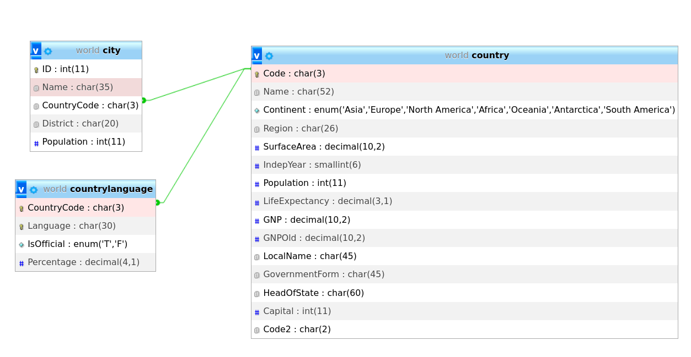

 world sample database using MySQL, the data set is available as a set of three tables:

    country: Information about countries of the world.

    city: Information about some of the cities in those countries.

    countrylanguage: Languages spoken in each country.
    

